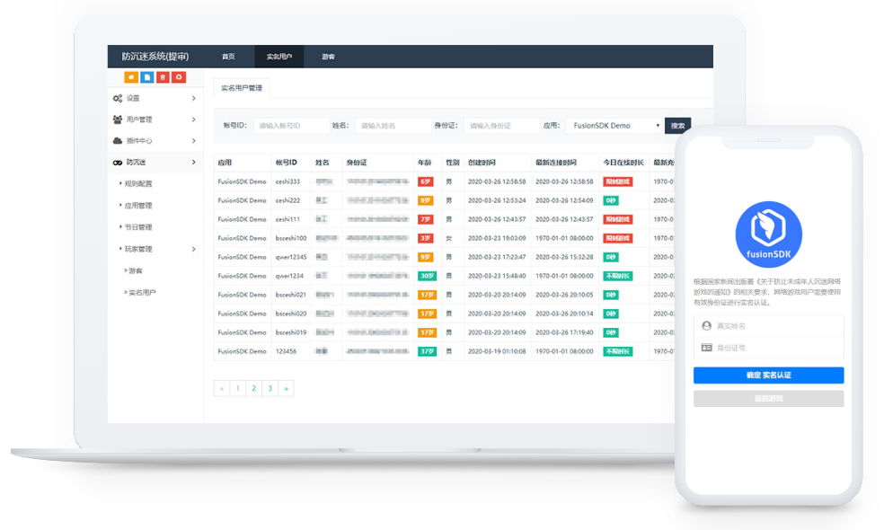

fusionAAS 手游实名认证&防沉迷系统
===============

根据国家新闻出版署《关于防止未成年人沉迷网络游戏的通知》的相关要求，网络游戏用户需要使用有效身份证进行实名认证；且对游客用户和未成年用户，进行了限制游戏和防沉迷的需求。本系统中含有独立的实名认证和防沉迷功能模块，方便手游快速接入其功能，并对其相关参数进行修改。

### 相关链接
- 官网: [https://fusionsdk.com/](https://fusionsdk.com/)
- 服务端demo: [http://demo.aas.fusionsdk.com/admin/](http://demo.aas.fusionsdk.com/admin/) `(帐号密码都是demo)`
- 安卓客户端demo: [https://gitee.com/fusionsdk/fusionAAS-android-demo](https://gitee.com/fusionsdk/fusionAAS-android-demo)
- H5客户端demo: 敬请期待
- 使用文档: [https://fusionsdk.com/docs/fusionaas.html](https://fusionsdk.com/docs/fusionaas.html)

### 系统功能

- 本系统支持后台登录功能
- 防沉迷设置，包含了游客和未成年用户的限制信息的修改
- 游戏应用的创建、编辑和删除功能，支持上传应用图标
- 节日的添加和编辑
- 游客玩家的在线时长等信息显示与编辑
- 实名玩家的身份信息和在线时长等信息显示与编辑
- 实名认证页面支持**全屏显示**和**最小窗口显示**模式选择

### 推荐生产环境

```
PHP 7.1+
MySql 5.6+
Nginx 1.10.3+
```

### 系统截图



### 联系我们

`FusionSDK 官方QQ技术交流群`: 518984834

`FusionSDK 官方微信公众号`: fusionsdk

### 版权信息

fusionAAS遵循Apache2开源协议发布，系统代码可以完全免费使用。商用之前请联系商务人员(`微信号: kevin1772io`)进行授权，我们将永久免费授权给您使用。

手游实名认证和防沉迷系统®软件著作权所有者为上海七九网络科技中心。

更多细节参阅 [LICENSE](LICENSE)
